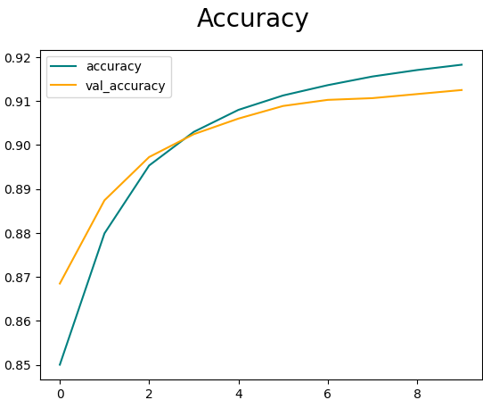
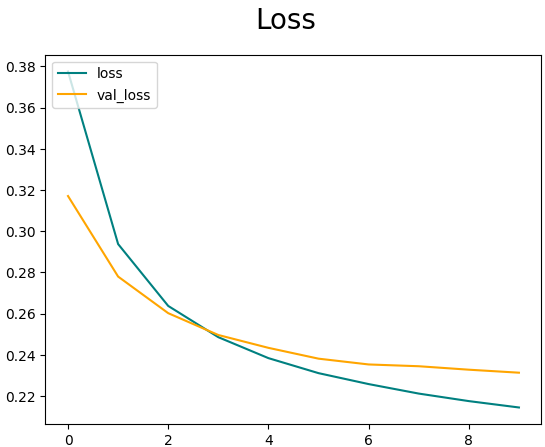
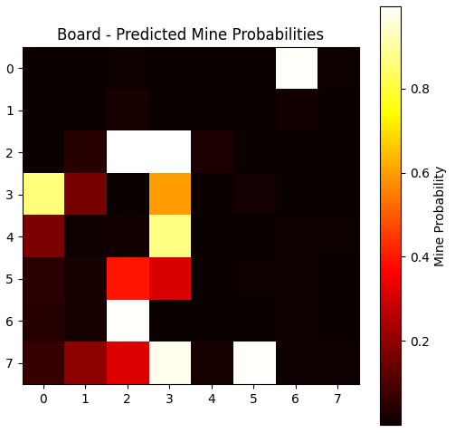

# Introduction to Supervised Learning

Supervised learning is a type of machine learning where a model is trained using labeled data. The data consists of input-output pairs where the model learns to map inputs to the correct outputs. For example, in this project, the input is a representation of a board state, and the output is a label indicating probabilities of mines in specific cells. The goal is for the model to generalize its learning to make accurate predictions on unseen data.

## Supervised learning typically follows these steps:

1. Dataset Preparation: Collect and preprocess data to create labeled examples.
2. Model Design: Define a model architecture suitable for the problem.
3. Training: Use the labeled data to optimize the model’s parameters.
4. Evaluation: Test the model on unseen data to measure its performance.

## Purpose of the Project

This project aims to determine whether a convolutional neural network (CNN) can predict the probabilities of mines in a board game scenario when simple rules fail, and advanced patterns or probabilities need to be used.

## Dataset Creation

To achieve this, I created a dataset of 250,000 board states. These board states were extracted from scenarios where simple game rules no longer provide clear solutions, such as:

- Situations where rules like 1-1 or 1-2-1 are required.
- Patterns that require probabilistic reasoning rather than direct logic.

The boards were generated programmatically to represent diverse and complex configurations. Each board was accompanied by a corresponding label file containing the ground truth about the presence or absence of mines in each cell.
How the Dataset Was Generated

## Board Representation:
The boards are stored in text files where each cell is encoded as:
- 0 for unopened cells.
- 1 for flagged cells.
- Numbers starting from 2 to represent the number of adjacent mines.

### Labels:
Each board has a corresponding label file that marks cells with 1 if they contain a mine and 0 otherwise.

### Scenarios:
    Scenarios were carefully designed to represent cases where decision-making involves probability or pattern recognition, ensuring the model learns from non-trivial examples.

Data Volume:
    A total of 250,000 board-label pairs were created to provide sufficient training examples for the model.

## Model Overview

The project uses a convolutional neural network (CNN) implemented in TensorFlow/Keras. The model architecture includes:

- Convolutional Layers: To detect patterns in the board, such as clusters of mines.
- Pooling Layers: To reduce spatial dimensions and focus on prominent features.
- Dense Layers: To combine extracted features for final predictions.
- Reshape Layers: To handle the input and output formats specific to the board representation.

The model was trained with the dataset, using 70% of the data for training, 20% for validation, and 10% for testing.
Results

- The model was trained to predict the probability of mines in cells with 75% certainty.
- Evaluation metrics such as binary accuracy and loss were used to assess performance.
- Visualizations such as loss curves and heatmaps of predicted probabilities were generated to interpret results.

<table align="center">
  <tr>
    <td></td>
    <td></td>
  </tr>
</table>

## Heatmap Visualization

The project includes a function to visualize the model's predictions as a heatmap, showing the probability of mines in each cell. This provides an intuitive way to analyze the model’s reasoning and evaluate its effectiveness.
Conclusion

This project demonstrates how supervised learning and CNNs can tackle complex probabilistic scenarios in board games. By generating a large dataset of challenging board states, the model successfully learned to make predictions where human reasoning might struggle. This approach can be extended to other domains requiring probabilistic reasoning or advanced pattern detection.

<table align="center">
  <tr>
    <td></td>
    <td></td>
  </tr>
</table>
